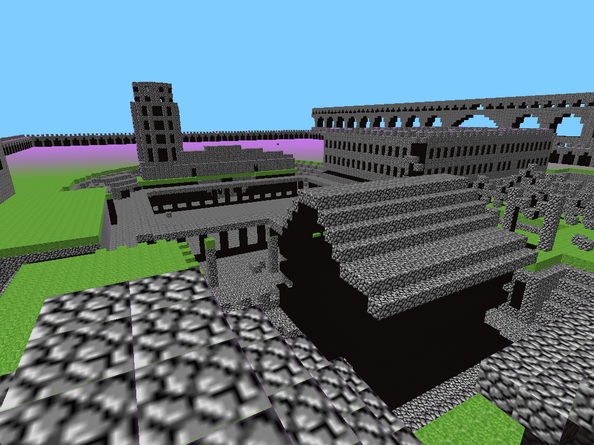

# Music
Intro + Outro: [Echo in the Wind](https://minecraft.wiki/w/Echo_in_the_Wind) - [Aaron Cherof](https://minecraft.wiki/w/Aaron_Cherof "Aaron Cherof")

Minecraft - C418

Sweden - C418

Featherfall - Aaron Cherof

Left to Bloom - Lena Raine

# Works Cited
[Create Any Minecraft Logo In Davinci Resolve For Free](https://www.youtube.com/watch?v=7BRW7IyTO5M)
- create Minecraft: A History In Chunks logo

[Minecraft Polyworlds as Explained by Xelanater](www.youtube.com/watch?v=7xmKQ7IM1D8)

[The Iron Titan - Minecraft Iron Golem Farm - 2600 Iron/hr (Works in 1.13)](https://www.youtube.com/watch?v=STs4wDJewNw)

[Minecraft - (EATS) Proof Of Concept](https://www.youtube.com/watch?v=4Vr7D4Pgois)

[The ACTUAL History of Early Minecraft](https://www.youtube.com/watch?v=mzm-S9Rz6zo)

[The origins of Minecraft](https://blog.omniarchive.uk/post/227922045/the-origins-of-minecraft/)

[Interview with Notch - Creator of Minecraft](https://www.youtube.com/watch?v=0NI78R9N2_0)

[RubyDung - Minecraft Wiki](https://minecraft.wiki/w/RubyDung)

[Infiniminer Demolition Fun](https://www.youtube.com/watch?v=Cd-eUIMPIjI)

[Cave game tech test (reupload)](https://www.youtube.com/watch?v=eUkZNk90rbQ)

[Clochán](https://en.wikipedia.org/wiki/Cloch%C3%A1n)

[Omniarchive](https://omniarchive.uk/)

[Xelanater Ellevanox - YouTube](https://www.youtube.com/@XelanaterEllevanox)

[Xelanater's Ultimate Old World Conversion Guide](https://www.youtube.com/playlist?list=PLfPLEZRH84UV_wmKNBtDRLAcMBf_MzUjO)

[Minecraft Discontinued Features Wiki](https://mcdf.wiki.gg/)

[PuffingFishHQ - YouTube](https://www.youtube.com/@PuffingFish)

[THESE UPDATES CURED MY DEAFNESS! | Minecraft Through the Ages Episode 12](https://www.youtube.com/watch?v=xdKVJSOHs80)

[First Version of Minecraft and Infinite Free Fall - Minecrab: Episode 1](https://www.youtube.com/watch?v=xV4NwWgGbwU)

[bugmancx - YouTube](https://www.youtube.com/@bugmancx)

[EthosLab - YouTube](https://www.youtube.com/@EthosLab)

# Further Research
https://minecraft.wiki/w/Cave_game_tech_test

https://minecraft.fandom.com/wiki/Java_Edition_pre-Classic_rd-131655
- has info on prior speculated versions, otherwise I prefer official wiki

https://minecraft.wiki/w/Java_Edition_pre-Classic_rd-132211

https://mcdf.wiki.gg/wiki/Java_Edition:Pre-Classic

[Minecraft: The Story of Mojang (2012)](https://www.youtube.com/watch?v=ggCIGOQloY4)

[How Minecraft Was Made](https://www.youtube.com/watch?v=EpqarCB9UD8)

https://en.wikipedia.org/wiki/Moir%C3%A9_pattern

https://en.wikipedia.org/wiki/Aliasing

https://en.wikipedia.org/wiki/Wagon-wheel_effect#Dangers

https://en.wikipedia.org/wiki/Nyquist%E2%80%93Shannon_sampling_theorem

https://www.pcgamer.com/the-making-of-minecraft/2/

https://www.youtube.com/watch?v=MHUKCskoooI

https://en.wikipedia.org/wiki/Pompeii

https://en.wikipedia.org/wiki/House_of_the_Vettii

https://en.wikipedia.org/wiki/Gallia_Lugdunensis

https://en.wikipedia.org/wiki/Domus

https://en.wikipedia.org/wiki/Insula_(building)

# Code
For the simpler edits I made, I'll just provide the updated methods and their locations.

I used [Vineflower](https://vineflower.org/) to decompile the unobfuscated .jar file, made modifications, and ran them directly in my IDE. As such, I'll just provide updated code segments and notes as these were very simple mods. (I've since been using [RetroMCP](https://github.com/MCPHackers/RetroMCP-Java)).

```powershell
java -jar vineflower.jar .\pc-132011.jar pc-132011
```

## Flight Mod
Replace whole `Player.java` file

## Free Fall
To get a direct on view of the Moiré patterns at 0 degrees rotation, I changed the resetPos method to:

```java
// Player.java
private void resetPos() {
  float x = 128;
  float y = 0;
  float z = 128;
  this.setPos(x, y, z);
  this.yRot = 0;
  this.xRot = -90;
}
```
and printed the players position every frame for video analysis.
```java
// RubyDung.java
System.out.printf("x: %.2f, y: %.2f, z: %.2f%n,", player.x, player.y - 1.62F, player.z);
```

## Failed Experiments
#### Disable Texture Filtering
- `9728` = `GL_NEAREST`
- `9729` = `GL_LINEAR`

Tried changing 
```java
GL11.glTexParameteri(3553, 10241, 9987);
GL11.glTexParameteri(3553, 10240, 9729);
```

I didn't have the foresight to save the rest, but I'll try and be a better archivist.



#### Add per-block UV offset
I'm not sure what I thought this would accomplish. I suppose I expected the Moire pattern to dissolve into noise.

`float v0 = 0.0F;`

- `float v0 = (x * 16 + z * 32) / 16.0F * 0.0624375F;`
- `float v0 = (x * RubyDung.player.x + z * RubyDung.player.z) / 0.0624375F;`
